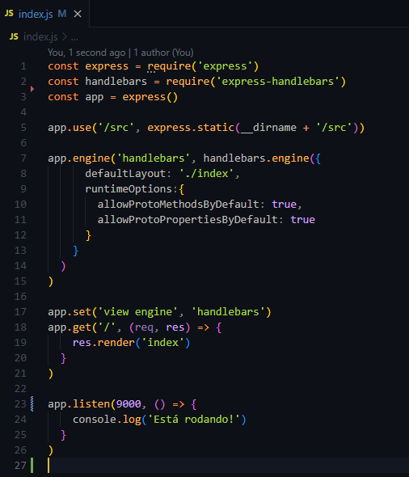
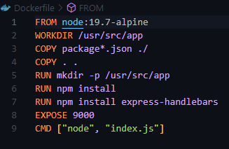

# Avaliação Sprint 3 - Programa de Bolsas Compass UOL / AWS e Univesp

Avaliação da terceira sprint do programa de bolsas Compass UOL para formação em machine learning para [AWS][aws].
A aplicação pode ser acessada clicando [aqui][aqui].

***

## Execução (Código Fonte)

Criar um container com o Docker para executar o projeto da [Sprint 2][sprint2] em uma instância EC2 da AWS Cloud.

### Instalação

  ```sh
    npm install
    npm install express express-handlebars
  ```
### Criando a aplicação com NodeJS

##### Estrutura da aplicação com NodeJS:
A partir do momento que o usuário acessa a URL raiz, ou `/`, da nossa aplicação, usamos a função `res.render('index')` do NodeJs para renderizar a página HTML contida na pasta `/src`.
O app está escutando na porta `9000`, portando é necessário colocar `:9000` ao final da URL.


#### Execução em máquina local
  ```sh
    node index.js
  ```

### Construindo a imagem do container
Estrutura do Dockerfile



## Equipe
| [<br><sub>Marcos Carvalho</sub>](https://github.com/onativo) | [<br><sub>O'Dhara Maggi</sub>](https://github.com/odharamaggi) | [<br><sub>Luciene Godoy</sub>](https://github.com/LucieneGodoy) | [<br><sub>Luiz Renato Sassi</sub>](https://github.com/luizrsassi) |
| :---: | :---: | :---: |:---: |

***
[sprint2]: <https://github.com/Compass-pb-aws-2023-Univesp/sprint-2-pb-aws-univesp/tree/main>
[aws]: <https://aws.amazon.com/pt/>
[aqui]: <http://18.212.213.146:9000/>

